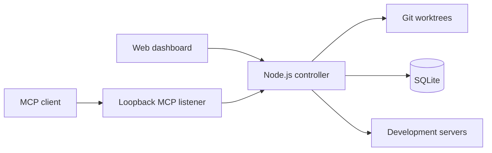

# Worktree Switcher

One dev server per project. Switch its Git worktree without changing the port.

If you keep the same application checked out on several branches, you probably
know the routine: find the terminal that owns the server, stop it, change
directories, start it again, then check whether an old process kept the port.
Worktree Switcher handles that routine from one local dashboard.

Register each repository once. The controller discovers its worktrees and gives
the project a stable port. You can start, stop, restart, or move the server to a
different worktree without disturbing the other projects in your stack.

Coding agents can use the same controller through MCP. They can inspect state,
claim a worktree, and release it when the task is done instead of starting a
second copy behind your back.

> [!IMPORTANT]
> This is a working prototype. The CLI and data model may still change. The npm
> package has not been published yet.

## What works

- Manage several repositories at once, each on its own port.
- Discover worktrees through Git's porcelain output.
- Start, stop, restart, and switch Node.js development servers.
- Detect `pnpm`, `npm`, `yarn`, and `bun` projects with a `dev` script.
- Show the active branch, commit, dirty state, PID, failures, and recent logs.
- Keep human locks and expiring agent claims in SQLite.
- Let MCP clients inspect projects and manage their own claims.
- Run Next.js development servers over HTTP or development HTTPS.
- Run the controller in a terminal or as a user service on Linux and macOS.
- Optionally cap the number of concurrently running managed servers.
- Use the dashboard in English or Polish. English is the default.

## Quick start

Worktree Switcher is not on npm yet, so run it from a local checkout.

You need Linux or macOS, Node.js 22 or newer, pnpm, and Git.

```bash
git clone https://github.com/pioootrek/worktree-switcher.git
cd worktree-switcher
corepack enable
pnpm install --frozen-lockfile
pnpm build
pnpm start
```

The controller prints a private browser URL. Open that exact URL, select
**Add project**, choose a Git repository, and assign its port. Worktree Switcher
will find every worktree attached to that repository.

The dashboard listens on `0.0.0.0:47831` by default, so other devices on the
LAN can reach it if the host firewall allows the connection. MCP stays on
`127.0.0.1:47832`.

To keep the dashboard on the same machine:

```bash
node dist/cli/index.js start --host 127.0.0.1
```

## Run it in the background

For daily use, install the built controller as a user service. The installer
uses systemd on Linux and a LaunchAgent on macOS. It does not need `sudo`, edit
firewall rules, or install a system-wide daemon.

Stop the foreground controller first, then run:

```bash
node dist/cli/index.js service install
node dist/cli/index.js service status
node dist/cli/index.js service open
```

`service open` reads the current pairing URL from an owner-only file. The URL
does not appear in the system journal or LaunchAgent logs.

See [Running Worktree Switcher as a user service](docs/user-service.md) for
configuration options, upgrades, logs, Linux session behavior, and removal.

## A typical workflow

1. Add your frontend repository and give it port 3000.
2. Add your API repository and give it port 4000.
3. Pick a worktree for each project.
4. Start both servers.
5. Switch the frontend to another branch. The API keeps running on port 4000.

Each project owns one runtime slot. A switch stops that project's current
process tree, starts the selected worktree on the same port, and waits for the
port to become ready. Operations for other projects continue independently.

The gauge in the dashboard configures an optional controller-wide capacity.
Each starting or running server consumes one slot. A switch retains its current
slot, while a failed start releases it. Lowering the limit never stops an
already running server; new starts remain blocked until usage falls below the
configured limit.

Dirty worktrees are allowed. The dashboard warns you but does not block the
server.

## How it works



Next.js builds the dashboard as static files. At runtime, one Node.js controller
serves those files, owns SQLite, reads Git metadata, and manages child
processes. There is no resident `next start` process behind the dashboard.

Launch commands are stored as an executable and argument array. The controller
spawns them without a shell. Neither the browser nor MCP can submit an arbitrary
command.

## Project commands and ports

When you add a repository, Worktree Switcher reads `package.json`, its
`packageManager` field, and lockfiles. The project must have a `dev` script.

| Project type | How the port is passed |
| --- | --- |
| Next.js | `PORT` environment variable |
| Vite, Astro, Nuxt, Angular | Framework-specific `--port` argument |
| Other Node.js servers | `PORT` environment variable |

A custom Node.js server can read the same environment variable:

```js
const port = Number(process.env.PORT ?? 3000);
server.listen(port);
```

Custom command presets and non-Node.js projects are not supported yet.

## MCP for coding agents

MCP is enabled by default at:

```text
http://127.0.0.1:47832/mcp
```

It uses Streamable HTTP and a persistent bearer token. Print the client
configuration with:

```bash
node dist/cli/index.js config mcp
```

The output contains the token. Treat it like a password. Keep it out of source
files, issues, logs, and chat.

Available tools:

| Tool | What it does |
| --- | --- |
| `list_projects` | Lists registered projects and their runtime placement |
| `get_server_capacity` | Reads the global server limit, usage, and slot holders |
| `get_project_status` | Reads runtime, claim, and selected-worktree state |
| `list_worktrees` | Lists worktrees discovered for a project |
| `claim_project` | Claims a worktree and moves or starts its server |
| `renew_project_claim` | Extends a claim owned by the current MCP session |
| `release_project_claim` | Releases a claim without stopping the server |

Claims are exclusive and tied to one discovered worktree. They expire after
inactivity and have an eight-hour maximum lifetime. An MCP client cannot run
arbitrary commands, choose arbitrary paths, or force-release somebody else's
claim.

Read [Reservations and MCP integration](docs/reservations-and-mcp.md) for the
claim model and security boundaries.

### Install the agent skill

The repository includes an Agent Skill for clients that work with managed
development servers. From this checkout:

```bash
codex_skill_dir="${CODEX_HOME:-$HOME/.codex}/skills"
mkdir -p "$codex_skill_dir"
cp -R skills/worktree-switcher "$codex_skill_dir/"
```

Restart the agent session after copying the skill. Configure MCP separately
with the private output of `config mcp`. The skill contains no credentials.

Add a short rule to each managed project's `AGENTS.md` or `CLAUDE.md`:

```md
## Development server

Use the `$worktree-switcher` skill before starting or switching this project's
development server. When the Worktree Switcher MCP tools are available, let the
controller own the server process and honor existing claims.
```

The full agent workflow lives in
[`skills/worktree-switcher/SKILL.md`](skills/worktree-switcher/SKILL.md).

## Next.js development HTTPS

Open the shield button on a project card to choose one of these modes:

- HTTP
- HTTPS with a certificate generated by Next.js
- HTTPS with a local private key, certificate, and optional CA file

Stop the project's server before changing this setting. For custom
certificates, Worktree Switcher saves canonical file paths. It never sends the
private key contents through the dashboard.

This controls the managed Next.js server only. It does not add TLS to the
Worktree Switcher dashboard.

## Security model

The dashboard can start and stop local processes, so its access URL is a
credential.

- Every controller start creates a new browser pairing token.
- Dashboard API calls, log requests, and events require that token.
- Browser mutations from another origin are rejected.
- The directory picker stays below the configured browse root.
- MCP listens on loopback and uses a separate persistent token.
- The controller only stops process trees it started.
- An unknown process on a configured port is reported, not killed.

The dashboard currently uses HTTP. Bind it to loopback, use a secure tunnel, or
limit access to a trusted LAN. If the host uses UFW, a LAN-only rule can look
like this:

```bash
sudo ufw allow from 192.168.1.0/24 to any port 47831 proto tcp comment 'Worktree Switcher LAN'
```

Adjust the subnet to match your network. The service installer never changes
the firewall.

## CLI reference

From a source checkout, replace `worktree-switcher` in the examples below with
`node dist/cli/index.js`.

```text
worktree-switcher start [options]

--port <port>          Dashboard port. Default: 47831
--host <address>       Dashboard bind address. Default: 0.0.0.0
--no-open              Do not open a browser
--browse-root <path>   Root exposed by the directory picker
--data-dir <path>      SQLite database and MCP token directory
--state-dir <path>     Lock, access record, and log directory
--mcp-port <port>      MCP port. Default: 47832
--no-mcp               Disable MCP
```

Other commands:

```text
worktree-switcher config path
worktree-switcher config mcp
worktree-switcher service install [start options] [--refresh]
worktree-switcher service status
worktree-switcher service start
worktree-switcher service stop
worktree-switcher service restart
worktree-switcher service open
worktree-switcher service url
worktree-switcher service uninstall
```

Project registration is currently available in the dashboard. Project removal,
CLI project management, and `doctor` are planned but not implemented.

## Data and logs

By default, SQLite and the MCP token live here:

```text
$XDG_DATA_HOME/worktree-switcher/state.sqlite3
~/.local/share/worktree-switcher/state.sqlite3
```

Runtime state and logs live here:

```text
$XDG_STATE_HOME/worktree-switcher/controller.lock
$XDG_STATE_HOME/worktree-switcher/service-access.json
$XDG_STATE_HOME/worktree-switcher/logs/controller.log
$XDG_STATE_HOME/worktree-switcher/logs/projects/<project-id>.log
```

The access record, lock, and token are owner-only files. Logs rotate at 5 MiB
and keep one previous copy. Worktree Switcher runs as a normal user and does
not write to `/var/log`.

## Development

```bash
pnpm check
pnpm build
```

Useful focused commands:

```bash
pnpm test
pnpm test:watch
pnpm typecheck
pnpm lint
```

Read [the product brief](docs/project-brief.md) before changing product or
architecture decisions. [Architecture decisions](docs/architecture.md)
describes the current process, persistence, and security boundaries.

## Contributing

Bug reports, focused pull requests, and notes from worktree-heavy setups are
welcome. Open an issue before a large change so the ownership and security
model can be discussed first.

Keep the controller independent from the repositories it manages. Changes
should preserve shell-free process spawning, per-project isolation, and the
rule that unrelated processes are never killed.

## Current limitations

- Only Node.js projects with a `dev` script are detected automatically.
- The dashboard uses HTTP and is intended for loopback or a trusted network.
- Project registration is available only in the dashboard. Project removal is
  not implemented yet.
- Managed-server CPU and memory monitoring is not implemented yet.
- The macOS LaunchAgent generator has unit coverage but still needs a real-host
  lifecycle test.
- Windows process-tree and service management are not supported.
- The npm package is not published yet.

The next release work is tracked in [`docs/backlog`](docs/backlog/).

## License

Worktree Switcher is available under the [MIT License](LICENSE). Third-party
attribution is recorded in [THIRD_PARTY_NOTICES.md](THIRD_PARTY_NOTICES.md).
