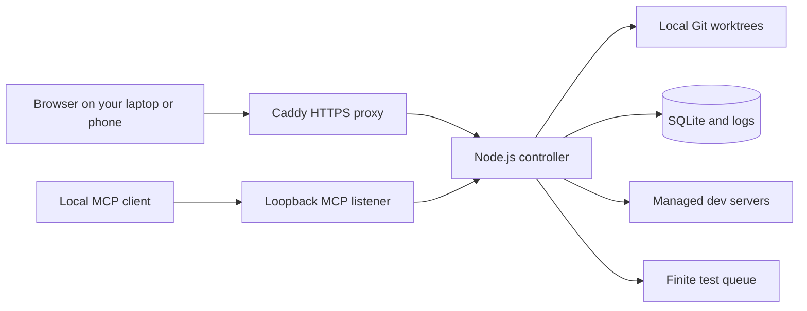

# Worktree Switcher

**Coordinate dev servers and test runs across Git worktrees, for you and your coding agents.**

Working on several branches with an AI coding agent? Give each project one
stable development port. Use the dashboard to switch the running worktree,
or let an MCP client claim it. Queue builds and tests with a shared concurrency
limit, then read which code was checked and what happened.

Worktree Switcher runs on your machine. It supports Node.js and Django projects,
keeps state in SQLite, and needs no hosted account. It is MIT licensed.

[Try it locally](#quick-start) · [Connect an MCP client](#mcp-for-coding-agents) · [Self-host over HTTPS](#self-hosting-and-https) · [Roadmap](#roadmap)


*The actual dashboard with example project data. English and Polish are supported.*

## When it helps

You have a frontend on port 3000, an API on port 4000, and several Git worktrees.
An agent needs to check a feature branch while you are using another one.

- **Keep a branch available for your work.** A human lock pins the project's
  managed server to a worktree. Agents using MCP must honor that lock.
- **Give an agent temporary ownership.** A claim reserves a worktree and starts
  or moves the project's server. Releasing the claim leaves the server running.
- **Switch one project at a time.** Move the frontend to another worktree on
  port 3000 while the API keeps running on port 4000.
- **Put heavy checks in a queue.** Run discovered test, lint, typecheck and build
  presets with a global parallel limit and at most one run per worktree.
- **Read the evidence.** See the branch, commit, dirty state, source changes,
  process outcome and logs associated with a test run.

Use it alongside your editor, terminal and existing MCP-capable coding client.
You create worktrees with Git or your usual tools; Switcher discovers them.
Agents need to use the controller for its ownership rules to apply. It cannot
prevent an unrelated terminal or client from starting its own processes.

## Quick start

**Status:** working prototype. A private `0.1.0-trial.1` tarball flow is available;
there is no npm registry release. The CLI and data model may change. Linux x64 is
the primary verified platform. macOS has a service installer, with limitations
listed below.

For the verified tarball, use the packaged
[trial installation guide](docs/package-trial.md). It installs with npm into a
user-owned prefix and does not require pnpm or a source checkout.

To build from source, install [Node.js 22 or newer](https://nodejs.org/), Git and
[pnpm](https://pnpm.io/installation). Use the pnpm version declared in
[`package.json`](package.json), currently `11.22.0`.

```bash
git clone https://github.com/pioootrek/worktree-switcher.git
cd worktree-switcher
pnpm install --frozen-lockfile
pnpm build
node dist/cli/index.js start --host 127.0.0.1
```

Open the **full private URL** printed by the controller. It includes the token
needed to pair your browser. Then:

1. Select **Add project**, choose a local Git repository and assign a port.
2. Pick one of its discovered worktrees and select **Start**.
3. Open the application's port. Select another worktree and **Switch** to check
   that branch at the same address.
4. Open **Tests**, choose a discovered preset and run it. Dependency installation
   is your responsibility for these local worktrees.

The example binds the dashboard to loopback on port 47831. MCP uses loopback
port 47832. The command's default host, when `--host` is omitted, is `0.0.0.0`.
Use the [HTTPS setup](#self-hosting-and-https) for access from another device.

### Keep it running in the background

Stop the foreground controller first. From the built checkout:

```bash
node dist/cli/index.js service install --host 127.0.0.1
node dist/cli/index.js service status
node dist/cli/index.js service open
```

The installer uses a Linux systemd user service or a macOS LaunchAgent. It does
not require `sudo` or change your firewall. See the
[user-service guide](docs/user-service.md) for options, updates and removal.

**After a restart, use `service open` or `service url` to obtain the current
pairing link.** Each controller start changes the browser token and session;
an old link will not pair a new browser session. MCP has a separate persistent
token. Keep both kinds of credential out of issues and shared logs.

## What is available on main

| Capability | What you can do today |
| --- | --- |
| Development servers | Start, stop, restart and switch a project's worktree while keeping its configured port |
| Project management | Add, list and remove projects through the CLI; add projects through the dashboard |
| Human and agent ownership | Lock a worktree or use expiring, session-owned MCP claims |
| Verification queue | Discover Node.js/Django presets, submit finite runs, cancel owned runs and retrieve durable results |
| Source attribution | Compare Git observations around a run and distinguish changed or uncertain source from a passing command |
| Capacity | Configure separate global limits for managed servers and test runs |
| Environment profiles | Select named server profiles and configure test environment policies |
| HTTPS | Serve the dashboard through Caddy; separately configure HTTPS for managed Next.js development servers |
| Monitoring | Inspect runtime logs, Linux process-group RAM/CPU, and cached worktree disk usage |
| Cache maintenance | Remove a stopped, unlocked Next.js worktree's `.next` cache with confirmation |
| Dashboard | Use English or Polish, desktop or mobile layouts, and explicit Git metadata refresh |

For Node.js, Switcher detects pnpm, npm, Yarn and Bun projects with a `dev`
script. Next.js uses `PORT`; Vite, Astro and Nuxt receive port arguments.
Angular workspaces can use `dev: ng serve` or the standard `start: ng serve`.
Django support targets a root-level `manage.py` and its development server;
the resolver prefers `.venv/bin/python`, then `venv/bin/python`, then `python3`.

### Tests and source evidence

The **Tests** tab discovers `test`, `test:*`, `check`, `lint`, `typecheck` and
`build` scripts in Node.js worktrees, plus `manage.py test` for Django. The
controller-wide FIFO queue defaults to one parallel run. Tests are separate
from the development-server lifecycle; a test submission does not claim or
switch the server.

Results persist in SQLite with bounded output tails; full logs are stored in
the controller's state directory. A graceful controller stop cancels active
runs. Recovery marks unfinished records interrupted after an unexpected stop.

Local tests run against the selected worktree, which may contain uncommitted
edits. Source observations help detect changes before or during execution;
they are not an immutable source snapshot. Fetching and testing a pushed SHA
on another worker is [in development](#roadmap).

## MCP for coding agents

Configure your MCP-capable client with the output of:

```bash
node dist/cli/index.js config mcp
```

This prints the loopback Streamable HTTP endpoint and its bearer token. Store
that configuration privately in your client. Client configuration formats vary;
Switcher does not require you to replace your current editor or agent.

The intended server workflow is:

```text
list_projects → list_worktrees → claim_project → get_project_status
               ...work with the managed server...
release_project_claim
```

For finite verification:

```text
list_test_presets → run_test → get_test_run_status → get_test_run
```

Use an exact discovered worktree path and reuse the idempotency key when retrying
the same submission. `wait_for_status_change` supports bounded waiting, and
`get_project_status_compact` avoids repeatedly fetching full project data.
`cancel_test_run` cancels runs owned by the current MCP session.

Claims expire, belong to the creating MCP session, and cannot force-release
another owner's reservation. The controller accepts discovered presets and typed
operations rather than arbitrary remote command text or filesystem paths.
See [reservations and MCP](docs/reservations-and-mcp.md) for details.

### Teach your agent to use it

The repository ships an [Agent Skill](skills/worktree-switcher/SKILL.md).
For Codex, copy it from this checkout:

```bash
codex_skill_dir="${CODEX_HOME:-$HOME/.codex}/skills"
mkdir -p "$codex_skill_dir"
cp -R skills/worktree-switcher "$codex_skill_dir/"
```

Restart the agent session and configure MCP separately. In a managed project's
agent instructions, add:

```md
Use the worktree-switcher skill and MCP tools before starting or switching this
project's development server. Honor existing claims. Use its managed test queue
for available verification presets.
```

## Self-hosting and HTTPS

Today, the browser is the client and one Node.js controller is the server. The
controller manages repositories and processes on the machine where it runs.
Next.js builds the panel into static files; it does not run a second resident
application server. SQLite keeps state local. Self-hosting needs no SaaS account.



Caddy is optional for loopback use. For HTTPS access from another device, follow
[Protect the controller with HTTPS](docs/controller-https.md). The guide covers
a domain with trusted certificates and LAN use with a private CA. Keep the
controller bound to loopback behind the proxy and configure `--public-url`.
The dashboard proxy does not expose the loopback MCP listener.

The shield button on a project card configures **that Next.js application's**
development HTTPS, using generated or local custom certificates. This is separate
from dashboard HTTPS. Stop the managed server before changing its TLS settings.

### Security and platform boundaries

Switcher can execute project code under your OS user. Use trusted repositories
and clients. Shell-free process spawning, claims and preset allowlists are not a
sandbox for untrusted code.

- Browser API requests and event streams require authentication; cross-origin
  browser mutations are rejected.
- The directory picker stays within its configured root. The controller stops
  only verified process trees it owns, never an unknown process occupying a port.
- Literal environment profile values are stored in SQLite. Use them for
  non-secret configuration; worker-side secret references remain planned.
- Managed-server resource metrics use Linux `/proc`. macOS reports that those
  metrics are unavailable; its LaunchAgent still needs real-host lifecycle evidence.
- Windows process-tree and service management are not supported.

## Roadmap

The [authentication roadmap](docs/backlog/notes/NOTE-20260909-self-hosted-saas-plan/authentication-modes-and-plugin.md)
has two planned stages: CLI-selected `open` (no authentication), `token` (one
CLI-generated token for all functions, including knowledge), and `better-auth`
(initially unavailable); then an optional Better Auth plugin for account login.
The core remains MIT. Plugin commercial terms and activation are undecided.
These modes are planned, not currently available CLI commands.

The next complete workflow is **push a commit, ask your worker to verify it, and
read the result from your existing client**. The worker will fetch the requested
SHA itself into an isolated run workspace, without moving your active dev worktree.

Remote verification has implementation work on separate branches:
[request authorization](https://github.com/pioootrek/worktree-switcher/pull/28),
[admission persistence](https://github.com/pioootrek/worktree-switcher/pull/29),
[exact-commit workspaces](https://github.com/pioootrek/worktree-switcher/pull/30)
and [attempt records](https://github.com/pioootrek/worktree-switcher/pull/31).
These are foundations, not an available end-to-end remote worker feature on
`main`. Follow the [remote verification plan](https://github.com/pioootrek/worktree-switcher/blob/main/docs/remote-verification-plan.md)
for delivery gates, recovery tests and current scope.

The longer-term direction is an optional, maintainer-operated SaaS for
coordination, with customer-owned execution workers. Self-hosting is intended to
remain complete and independent. Hosted accounts, organization isolation, shared
project memory and agent-fleet coordination are planned; there is no hosted
signup or pricing offer today. See the
[self-hosted and SaaS plan](https://github.com/pioootrek/worktree-switcher/blob/main/docs/backlog/notes/NOTE-20260909-self-hosted-saas-plan/implementation-plan.md).

## CLI and documentation

From this source checkout:

```bash
node dist/cli/index.js project add /path/to/repo --name "My app" --port 3000
node dist/cli/index.js project list --json
node dist/cli/index.js project remove <project-id>
node dist/cli/index.js doctor
```

With no explicit port, `project add` selects an available port between 3000 and
3999. Project commands use the authenticated service API when it is running;
offline access takes the singleton lock before opening state.

| Guide | Use it for |
| --- | --- |
| [User service](docs/user-service.md) | Installation, restarts, access links, logs and removal |
| [Package trial](docs/package-trial.md) | Verified tarball, checksum, user-prefix install, upgrade and removal |
| [Controller HTTPS](docs/controller-https.md) | Caddy, certificates, public origin and backend binding |
| [Reservations and MCP](docs/reservations-and-mcp.md) | Ownership, client integration and agent permissions |
| [Architecture](https://github.com/pioootrek/worktree-switcher/blob/main/docs/architecture.md) | Controller, persistence and lifecycle boundaries |
| [Module development](https://github.com/pioootrek/worktree-switcher/blob/main/docs/module-development.md) | Code locations and focused verification commands |
| [Resource budget](https://github.com/pioootrek/worktree-switcher/blob/main/docs/resource-budget.md) | Measured overhead, benchmark method and acceptance thresholds |
| [Backlog](https://github.com/pioootrek/worktree-switcher/blob/main/docs/backlog/index.json) | Open work and links to implementation plans |

Default persistent data is under `$XDG_DATA_HOME/worktree-switcher` (normally
`~/.local/share/worktree-switcher`). Runtime state, the private access record
and logs are under `$XDG_STATE_HOME/worktree-switcher` (normally
`~/.local/state/worktree-switcher`). These locations can be overridden at startup.

## Contributing and feedback

Try Switcher with one repository and your usual coding client. Then
[open an issue](https://github.com/pioootrek/worktree-switcher/issues/new) with
your OS, framework, MCP client and the step that helped or got in the way.
Please omit pairing URLs, tokens and secrets. Reports from actual worktree-heavy
setups are especially useful while the installation and agent workflow take shape.

For source changes:

```bash
pnpm check
pnpm build
pnpm test:ui
pnpm smoke:package
```

The browser suite exercises the exported dashboard with a fixture API. CI also
runs real-controller, HTTPS and E2E suites. `smoke:package` installs the built
tarball into an isolated consumer and checks the CLI, native SQLite dependency,
dashboard, HTTP and MCP. It does not alter your installed user service.
Run builds and browser suites within your machine's resource policy.
Read [AGENTS.md](https://github.com/pioootrek/worktree-switcher/blob/main/AGENTS.md)
before contributing code.

## License

[MIT](LICENSE). Dependency attribution is recorded in
[THIRD_PARTY_NOTICES.md](THIRD_PARTY_NOTICES.md).

## Project knowledge

The **Knowledge** view contains Backlog, Discussions and Memory. Knowledge
projects remain available without a runtime project or repository. Memory stores
decisions, open questions and notes with pinned source revisions, tags and an
optional legacy ID. Hub import remains a later stage.

Memory requires at least one source: a record in the same project with its
current revision, or an explicit HTTP/HTTPS link. Only an owner session with
`knowledge:approve` can approve memory. Approval is a revisioned mutation and
points to the resulting revision. Editing, archiving or restoring clears current
approval; history retains its provenance. Superseded records remain readable and
immutable, with the replacement's ID and revision. Supersession retains the
approval of the earlier revision as historical provenance. Memory writes also
require `knowledge:read` because their responses include retained content.

The Memory search can include threads, replies and tasks. It matches literal
Unicode text in titles and bodies, with filters for record type, state, memory
tags and memory legacy IDs. Archived and superseded records are hidden unless
explicitly included. Search is project-scoped and never scans Git.

A task's **Next session context** shows its scope, directly linked memory,
approved decisions, proposals and open questions. Source revisions disclose
stale or inactive evidence. Excerpts are labelled and link to the full records;
no model-generated summary is implied. Context and export responses are bounded
to 256 KiB. Read subsequent pages using `nextOffset`; retain the same page limit.

`knowledge task_context` requires `knowledge:read`. `knowledge export_context`
also requires `knowledge:export` and returns Markdown or JSON in `content`.
Exports are versioned context pages, not a project backup. They include IDs,
revisions, generation time, page coordinates and a fingerprint. Compare an old
export using `knowledge check_context_export` with the same project, task,
limit, offset and fingerprint. Its `current` field describes that page only.

```bash
worktree-switcher knowledge create_memory --input-file memory.json
worktree-switcher knowledge search --json '{"projectId":"<project-id>","query":"storage"}'
worktree-switcher knowledge task_context --json '{"projectId":"<project-id>","taskId":"<task-id>"}'
worktree-switcher knowledge export_context --json '{"projectId":"<project-id>","taskId":"<task-id>","format":"markdown"}'
```

Example `memory.json` (replace IDs and the source revision):

```json
{
  "projectId": "<project-id>",
  "title": "Storage decision",
  "body": "Keep one SQLite connection owner.",
  "category": "decision",
  "tags": ["storage"],
  "legacyId": null,
  "sources": [{ "kind": "task", "id": "<task-id>", "revision": 1 }],
  "idempotencyKey": "storage-decision-1"
}
```

Knowledge requires an owner session or a scoped agent token. The existing
pairing token and shared runtime MCP token do not grant knowledge access. Use
`worktree-switcher identity bootstrap-owner` for the initial owner, then supply
that session through `WORKTREE_SWITCHER_OWNER_TOKEN` for identity administration.
Use `identity renew-owner` before expiry; `identity recover-owner` is a local
recovery operation that requires the controller to be stopped and acquires its
singleton lock. Enter an active session in **Sign in to knowledge** in the UI.

Create a project with `identity create-knowledge-project --name "My project"`.
Give the owner and each participating agent explicit grants with
`identity grant-knowledge --principal-id <principal-id> --project-id <project-id>
--permissions knowledge:read,knowledge:write`. Existing `create-agent` and
`issue-agent-token` commands provide agent credentials. Keep credentials private.

The online CLI uses `WORKTREE_SWITCHER_KNOWLEDGE_TOKEN` (or
`WORKTREE_SWITCHER_OWNER_TOKEN`) and never opens the database:

```bash
worktree-switcher knowledge projects
worktree-switcher knowledge threads --json '{"projectId":"<project-id>"}'
worktree-switcher knowledge create_thread --input-file finding.json
```

`finding.json` contains `projectId`, `title`, `body` and `idempotencyKey`.
Reuse the same key and input after a lost response. Editing a task requires
`expectedRevision`; conflicts preserve the saved record. CLI failures return
nonzero and carry the application error code. The command lists its available
operations when invoked without an operation. `--json` and `--input-file` contain
only the operation input; authentication comes from the environment.

Scoped MCP sessions expose `get_identity` and `knowledge_*` tools, including
`knowledge_projects`, `knowledge_create_thread`, `knowledge_create_reply`,
`knowledge_task_from_thread`, `knowledge_create_task` and `knowledge_update_task`.
HTTP uses `POST /api/knowledge` with a bearer credential and the envelope
`{"operation":"threads","input":{"projectId":"<project-id>"}}`.
All three transports invoke the same application operations. Pages default to
25 records (maximum 100) and provide `nextOffset`; requests are limited to 64 KiB.
Thread and task lists contain summaries; full bodies use the detail operations.

Record links use `?view=knowledge&knowledgeProject=...&knowledgeTab=...&record=...`
and survive refresh of the static dashboard. Drafts, write failures and retry
keys remain in the current browser tab's session storage. Knowledge changes
reuse the dashboard event connection, filter projects by current grants and
refresh only knowledge. Revoked grants also block reads and idempotent retries.
