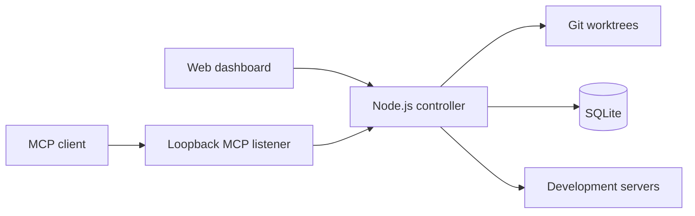

# Worktree Switcher

Run the right Git worktree on the right port.

Worktree Switcher is a local control panel for developers who keep several
branches checked out with `git worktree`. Register a repository once, then
start, stop, restart, or move its development server between worktrees without
changing the project's port.

It also exposes a local MCP server, so coding agents can inspect project state
and claim a worktree without racing you or another agent.

> [!IMPORTANT]
> This is an early, working prototype. The data model and CLI may still change.
> The package is not published to npm, and the repository does not have a
> license yet.

## Why this exists

A worktree makes it easy to keep multiple branches checked out. The awkward
part starts when each branch can run the same application. You have to remember
which directory owns the dev server, stop the old process, start the new one,
and keep the port free.

Worktree Switcher keeps that state in one place. Each registered project gets
its own runtime slot, stable port, selected worktree, logs, and lock. Projects
remain independent, so switching a frontend does not interrupt an API or docs
server managed by the same controller.

## What works today

- Discover worktrees with Git's porcelain output.
- Manage several projects at the same time, each on its own fixed port.
- Start, stop, restart, and switch development servers from a web dashboard.
- Detect `pnpm`, `npm`, `yarn`, and `bun` projects with a `dev` script.
- Show branch, commit, dirty state, process status, failures, and recent logs.
- Keep human locks and expiring agent claims in SQLite.
- Let MCP clients read status and claim, renew, or release a worktree.
- Run Next.js development servers over HTTP or HTTPS with generated or custom
  certificates.
- Use the dashboard in English or Polish. English is the default.

## Install from source

Worktree Switcher is not published to npm yet. Install and run it from a local
checkout.

Requirements:

- Linux or macOS
- Node.js 22 or newer
- pnpm
- Git

Replace `<repository-url>` with this repository's GitHub URL:

```bash
git clone <repository-url>
cd worktree-switcher
corepack enable
pnpm install --frozen-lockfile
pnpm build
pnpm start
```

The controller prints a private access URL. Open that exact URL in your
browser, then use **Add project** to select a Git repository and assign its
port.

By default, the dashboard listens on port `47831` on every network interface.
The MCP listener uses `127.0.0.1:47832` and is not exposed to the LAN.

## How it works



The Next.js dashboard is built as static files. A small Node.js controller
serves those files, owns the SQLite database, reads Git metadata, and manages
child processes. There is no persistent Next.js application server behind the
dashboard.

The controller stores launch commands as an executable and argument array. It
spawns them without a shell and does not accept arbitrary commands from the
browser or MCP.

## Project commands and ports

When you add a repository, Worktree Switcher reads `package.json`, its
`packageManager` field, and lockfiles. The project must have a `dev` script.

Port handling depends on the detected framework:

| Project type | Port handling |
| --- | --- |
| Next.js | `PORT` environment variable |
| Vite, Astro, Nuxt, Angular | Framework-specific `--port` argument |
| Other Node.js servers | `PORT` environment variable |

A custom Node.js server can follow this contract:

```js
const port = Number(process.env.PORT ?? 3000);
server.listen(port);
```

Custom command presets and non-Node.js projects are not supported yet.

## MCP for coding agents

MCP is enabled by default at:

```text
http://127.0.0.1:47832/mcp
```

It uses Streamable HTTP with a persistent bearer token. Print a client
configuration with:

```bash
worktree-switcher config mcp
```

This command prints the token. Treat its output like a password. Do not paste
it into an issue, log it, or commit it to a repository.

The MCP server exposes these tools:

| Tool | Purpose |
| --- | --- |
| `list_projects` | List registered projects and runtime placement |
| `get_project_status` | Read runtime, reservation, and selected worktree state |
| `list_worktrees` | List worktrees discovered for a project |
| `claim_project` | Claim a worktree and move or start its server |
| `renew_project_claim` | Extend a claim owned by the current MCP session |
| `release_project_claim` | Release a claim without stopping the server |

Agent claims are exclusive and tied to one discovered worktree. They renew
while the MCP session remains active, expire after inactivity, and have an
eight-hour maximum lifetime. Lease secrets stay inside the MCP session. MCP
cannot run arbitrary commands, select arbitrary paths, or force-release another
owner's claim.

The **MCP** button in the dashboard shows listener state, active sessions,
transport, endpoint, and access controls without exposing secrets.

See [docs/reservations-and-mcp.md](docs/reservations-and-mcp.md) for the full
reservation and MCP design.

### Install the agent skill

The repository includes a `worktree-switcher` skill. Installing it is
recommended for agents that will start, inspect, or switch managed development
servers.

For a personal Codex installation, run this from the Worktree Switcher checkout:

```bash
codex_skill_dir="${CODEX_HOME:-$HOME/.codex}/skills"
mkdir -p "$codex_skill_dir"
cp -R skills/worktree-switcher "$codex_skill_dir/"
```

Restart the agent session after copying the skill. For another client that
supports Agent Skills, copy `skills/worktree-switcher` to that client's skill
directory.

The skill does not contain credentials and does not configure MCP. Run
`worktree-switcher config mcp`, then add the returned URL and authorization
header to the client's private MCP configuration. Never put that output in a
repository.

For a managed project, a short instruction in `AGENTS.md` or `CLAUDE.md` is
enough to make the intended workflow explicit:

```md
## Development server

Use the `$worktree-switcher` skill before starting or switching this
repository's development server. When the Worktree Switcher MCP tools are
available, let the controller own the server process and honor existing claims.
```

The complete behavior lives in
[`skills/worktree-switcher/SKILL.md`](skills/worktree-switcher/SKILL.md), so it
does not need to be copied into every repository.

## Next.js development HTTPS

Open the shield button on a project card to configure HTTPS for its managed
Next.js server. The server must be stopped before you change this setting.

Available modes:

- HTTP
- HTTPS with a certificate generated by Next.js
- HTTPS with a local private key, certificate, and optional CA file

Worktree Switcher passes Next.js the appropriate `--experimental-https` flags.
For custom certificates, it stores canonical file paths and never sends the
private key contents through the dashboard.

This setting applies only to the managed Next.js server. It does not add TLS to
the Worktree Switcher dashboard. See the
[Next.js CLI documentation](https://nextjs.org/docs/app/api-reference/cli/next#using-https-during-development)
for details about its development HTTPS support.

## Security model

The dashboard controls local processes, so access to it matters.

- Every controller start creates a new browser pairing token.
- Dashboard API calls, logs, and SSE events require that token.
- Browser mutations from a different origin are rejected.
- The directory browser is limited to the user's home directory by default.
- MCP listens on loopback and uses a separate persistent bearer token.
- Worktree Switcher only stops process trees it started. It does not kill an
  unknown process just because that process owns a configured port.

The prototype serves the dashboard over HTTP. Use it only on a trusted LAN or
through a secure tunnel. If the host runs UFW, allow only your LAN subnet. For
example:

```bash
sudo ufw allow from 192.168.1.0/24 to any port 47831 proto tcp comment 'Worktree Switcher LAN'
```

To keep the dashboard on the same machine, bind it to loopback:

```bash
worktree-switcher start --host 127.0.0.1
```

## Configuration

```text
worktree-switcher start [options]

--port <port>          Dashboard port. Default: 47831
--host <address>       Dashboard bind address. Default: 0.0.0.0
--no-open              Do not open a browser
--browse-root <path>   Root exposed by the directory picker
--data-dir <path>      SQLite database and MCP token directory
--state-dir <path>     Log directory
--mcp-port <port>      MCP port. Default: 47832
--no-mcp               Disable MCP
```

Other commands:

```bash
worktree-switcher config path
worktree-switcher config mcp
```

## Data and logs

Project configuration, selections, reservations, and audit events live in
SQLite:

```text
$XDG_DATA_HOME/worktree-switcher/state.sqlite3
~/.local/share/worktree-switcher/state.sqlite3
```

Logs use the platform state directory:

```text
~/.local/state/worktree-switcher/logs/controller.log
~/.local/state/worktree-switcher/logs/projects/<project-id>.log
```

Log files rotate at 5 MiB and keep one previous copy. Worktree Switcher runs as
a normal user, so it does not write to `/var/log` or require administrator
access.

## Development

Run the checks used by the project:

```bash
pnpm check
pnpm build
```

Useful development commands:

```bash
pnpm test
pnpm test:watch
pnpm typecheck
pnpm lint
```

Read [docs/project-brief.md](docs/project-brief.md) before changing product or
architecture decisions. The current architecture is documented in
[docs/architecture.md](docs/architecture.md).

## Contributing

Bug reports, focused pull requests, and notes from real worktree-heavy setups
are welcome. For a larger change, open an issue first so the design can be
discussed before code is written.

Please keep the controller independent from the repositories it manages. New
features should preserve shell-free process spawning, per-project isolation,
and the rule that unrelated processes are never killed.

## Current limitations

- Only Node.js projects with a `dev` script are detected automatically.
- The dashboard uses HTTP and is intended for a trusted network.
- Project management is available in the GUI, not through the CLI.
- Background service installation is not included.
- Windows process-tree management is not supported.
- The npm package is not published.

The next practical milestones are custom launch presets, CLI project
management, validation with three concurrent projects, background service
installation, and a first public package.
