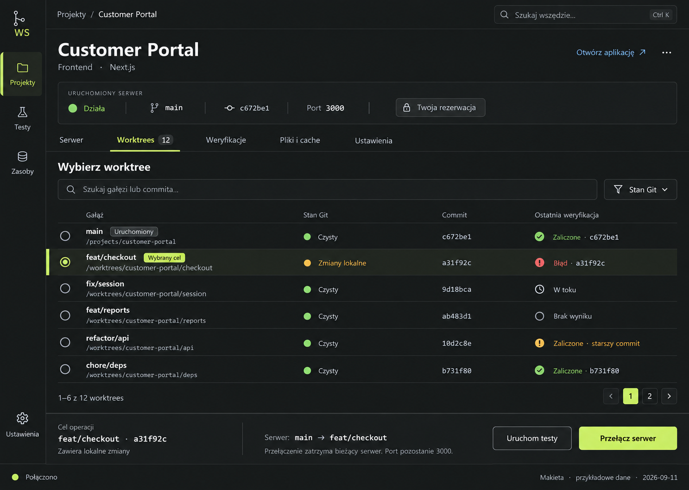

# Approved GUI direction

Status: owner-approved visual direction, recorded on 2026-09-11. This is the
reference for subsequent GUI design work. The redesign is not implemented.

The owner approved the Customer Portal project-detail mock after opening its
image link and requested: "Bardzo mi się podoba, zapisz jako obowiązujący
kierunek". This approval applies to the final mock below, derived from the
second option in the latest three-image exploration. Earlier options do not
have equal authority.

## Visual direction

Use the charcoal and restrained lime direction, called "Konsola operatorska"
during exploration. Preserve the image's overall hierarchy and working density:

- Neutral charcoal surfaces, readable near-white text, quiet separators and
  a restrained lime accent for selection and the main action.
- Compact navigation with visible labels, breadcrumbs, a clear project title
  and project-specific tabs.
- Aligned table rows, modest corner radii and sparse decoration. Information
  grouping and typography establish hierarchy before borders or elevation.
- Readable product typography, with monospace for branches, commits and paths.
  Do not shrink text to force more controls onto a screen.
- Semantic states include text and an icon. Ordinary stopped or reserved
  states are neutral; failures and relevant source warnings receive emphasis.

The image establishes a direction, not exact production tokens. Validate
contrast, focus visibility, keyboard use, long labels, Polish and English,
responsive layouts and existing light/system theme support during implementation.
The visible blue link in the generated mock is an incidental detail, not a
second brand palette. The lime accent remains the main selection/action cue.

## Interaction hierarchy to preserve

The current server state appears above the worktree list. In the mock, the
server runs on `main`, while `feat/checkout` is only the selected operation
target. Selecting a row must not visually rewrite the running server's identity.

The action area names the target and shows the proposed transition before
"Przełącz serwer". Test execution is a separate action with an explicit source.
A result for an older commit is visibly qualified. Local edits, runtime
reservations and source attribution retain their actual application semantics.

Use these patterns when designing the project catalog, project details and
verification screens. The intended scale is 30 to 300 registered projects;
this mock is not evidence of usability or runtime capacity at that scale.

## WinPath boundary

The owner explicitly forbids copying WinPath's appearance. Do not reuse its
visual identity, palette, layout recipes, decorative treatments or branded
components as the Switcher design source.

WinPath is a reference only for the development process: owning components
over shadcn, centralizing semantic tokens, maintaining component contracts and
a visual catalog, and checking accessibility and responsive behavior. Build
Switcher's visual system independently within this repository.

## Approval scope and provenance

The owner approved this visual direction and asked to preserve it. The earlier
discussion of filtering, groups, archives, bulk actions, shared knowledge and
agent coordination remains design context or existing backlog work. This
approval does not approve every proposed feature or initiate implementation.

The attached PNG is the exact approved image, copied without image editing.
It was generated with the built-in Image Gen tool. Its fictional project data,
paths, counts, times and controls are examples, not live operational evidence.
The source generation identifier and file checksum are recorded in `note.json`.
Keep this image in the repository rather than relying on the conversation's
generated-image storage. Supersede this direction only when the owner adopts
a replacement, preserving the decision history.
