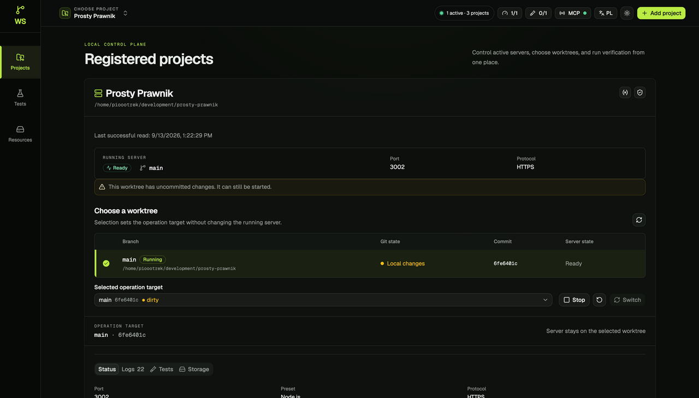
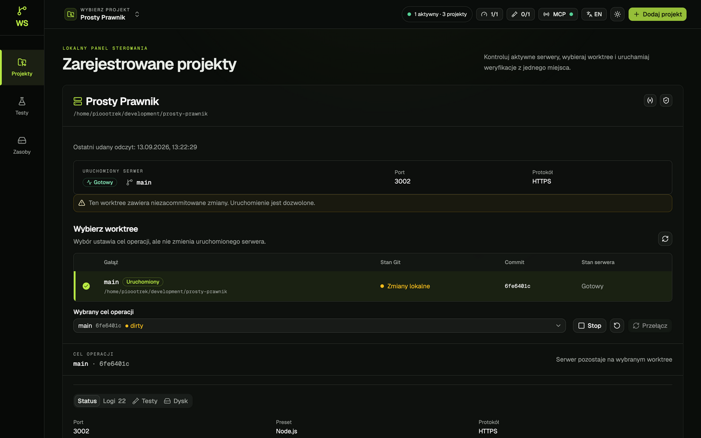

# Audyt GUI Worktree Switcher — 13.09.2026

Audyt obejmuje działający interfejs we wbudowanej przeglądarce T3 Code oraz kod worktree na commicie `a94ee75f63302d4702eead1d2e301e7b144b1d83`.

**Wniosek:** największe problemy dotyczą czytelności stanów, spójności celu operacji i dostępu do podstawowych działań. Wymiana komponentów pomoże ujednolicić interakcje, ale sama nie rozwiąże błędów w doborze danych i strukturze strony.

**25 ustaleń: 5 P1, 16 P2 i 4 P3.** Raport uzupełniono o ponowną weryfikację na pierwotnej karcie użytkownika; szczegóły i korekta pomiaru kontrastu znajdują się w końcowej sekcji „Uzupełnienie weryfikacji”. P1 = naprawić w pierwszej kolejności; P2 = istotny problem obsługi lub struktury; P3 = spójność i dopracowanie. To priorytety prac GUI, nie oceny bezpieczeństwa. Ustalenia oparte wyłącznie na kodzie mają osobne oznaczenie.

## Zakres i wiarygodność

- Korzystałem z dotychczasowej karty użytkownika. Sprawdziłem projekty z jednym i 25 worktree, wybór projektu, filtrowanie, wybór celu, zakładki testów i Dysku, formularze limitów, HTTPS, zmiennych, dodawania projektu, przeglądania katalogów i status MCP.
- Sprawdziłem zmianę PL/EN, fokus wyszukiwarki, ArrowDown i Enter przy wyborze projektu, pusty wynik wyszukiwania i walidację pustego formularza.
- Dwa poprawne zrzuty zapisano i otwarto do inspekcji. Kolejne żądania screenshotu oraz resize nie działały: `Preview snapshot failed`, `PreviewAutomationTimeoutError`. Status narzędzia zwracał `visible: false`, podczas gdy odczyt strony potwierdzał `document.visibilityState === "visible"`. To ograniczenie automatyzacji, nie usterka audytowanego GUI.
- Dalsze sprawdzanie odbywało się przez interakcje i DOM we wbudowanej przeglądarce. Część kliknięć modalnych wykonano programowo przez DOM, gdy narzędzie kliknięcia zawodziło; nie stanowią one dowodu poprawności obsługi fizyczną myszą ani fokusu. Przejściowo zamykane dialogi pozostawały w DOM podczas animacji; nie uznałem tego za błąd produktu.
- **Nie uzyskano nowych zrzutów dialogów, jasnego motywu ani małego ekranu.** Ponowna weryfikacja rozszerzyła jednak dowody o rzeczywiście wyrenderowany układ mobilny 427×925, niski ekran 1402×701, pomiary tekstu i teł oraz interakcje klawiaturą. To dowody DOM/CSS, a nie inspekcja nowych screenshotów. Rzeczywisty zoom 200%, czytnik ekranu i klawiatura ekranowa pozostają niezweryfikowane. Nie deklaruję zgodności z WCAG.
- Otwarty interfejs różni się od kodu worktree: m.in. przycisk usuwania projektu obecny w kodzie nie występował w początkowym DOM. Nie ustalono SHA działającego eksportu. Wskazane miejsca w kodzie opisują ten checkout, nie dowodzą identyczności wdrożenia.
- Nie uruchamiałem, nie zatrzymywałem ani nie przełączałem serwerów; nie zlecałem testów, nie zapisywałem ustawień, nie usuwałem cache/projektów i nie zmieniałem limitów hosta. Nie uzyskiwałem claimu — oglądałem już otwarty panel kontrolera.
- Nowa pomocnicza karta pozwoliła zaobserwować ekran bez klucza w sessionStorage; wróciłem do pierwotnej karty. Widok błędu nie oznaczał utraty danych ani awarii kontrolera.
- Kod aplikacji pozostał bez zmian. Artefakty audytu znajdują się w tym katalogu.

## Przejście przez interfejs

| Krok | Sprawdzony obszar | Ocena i granice |
|---|---|---|
| 1 | Główny widok, Prosty Prawnik, ciemny motyw EN | Zrzut + DOM. Czytelny stan serwera, ale duplikacja celu i pozorna nawigacja. |
| 2 | Ten sam widok po zmianie na PL | Zrzut + DOM. Zmiana języka działa; pozostaje „dirty”. |
| 3 | Przełącznik projektów, wyszukiwanie i klawiatura | Interakcje + DOM. Filtr i pusty wynik działają; zapytanie pozostaje po wyborze. Zrzut otwartego menu zablokowany. |
| 4 | WinPath z 25 worktree i wybór innego celu | DOM + geometria. Cel się zmienia, lista przesuwa działania i zakładki daleko w dół. Brak nowego zrzutu. |
| 5 | Testy wybranego worktree i historia projektu | DOM. Dane źródła są obecne; brakuje zakresu historii i kwalifikacji aktualności względem celu. Bez uruchamiania testów. |
| 6 | Dysk, wybór worktree, pomiary i historia | DOM. Pomiary i potwierdzenie usuwania mają bazę komponentową; nazwy katalogów słabo wiążą się z gałęziami. Bez usuwania i skanów. |
| 7 | Ustawienia kolejki testów i pojemności serwerów | DOM. Sensowne opisy ograniczeń i użycia; ikony w headerze mało opisowe. Bez zapisu limitów. |
| 8 | Jasny motyw | Przełączenie + pomiary rzeczywistych elementów tekstowych i złożonych teł CSS. Potwierdzony niski kontrast badge’y, Git i logów. Opis ostrzeżenia skorygowano na 4,62:1; bez nowego zrzutu. |
| 9 | HTTPS oraz zmienne środowiskowe | DOM + kod. Pola i opisy istnieją; błędy zapisu kierowane są poza dialog. Bez zmiany danych. |
| 10 | Dodawanie projektu, pusta walidacja, przeglądanie katalogów | DOM + geometria i klawiatura. Potwierdzone obcięcie dialogu 774 px w widoku 1402×701; Tab/Shift+Tab i Escape działają. Bez utworzenia projektu. |
| 11 | Status MCP | DOM + kod. Czytelny zakres informacji; brak kopiowania endpointu/polecenia to możliwość ulepszenia. Bez odczytu sekretów. |
| 12 | Nowa karta bez zapisanej autoryzacji | DOM + kod. Błąd dostępu miesza się z pustym katalogiem. |
| 13 | Responsywność i zoom | Zmierzono rzeczywiste układy 427×925 i 1402×701. Resize zgłasza timeout, rozmiary różnią się od żądanych i mogą wracać do fill. Brak nowych zrzutów i testu rzeczywistego zoomu 200%. |

## Zaakceptowane zrzuty

### 01 — Widok główny EN, ciemny motyw

Źródłowy viewport miał 1709×973 CSS px, DPR 2. Narzędzie zwróciło obraz 1280×729, więc rozmiarów kontrolek nie wyliczano z pikseli tego obrazu.

### 02 — Widok główny PL, ciemny motyw

To nadal widok główny, **nie** otwarty przełącznik projektów. Próba kliknięcia menu przed tym zrzutem nie otworzyła go. Odczyt DOM: 1578×986; nie jest to skutecznie ustawiony viewport 1440×900.

## Co warto zachować

- Oddzielne, nazwane podsumowania uruchomionego serwera i celu operacji — dobry zamiar wymagający konsekwentnego zastosowania w Status/Dysk.
- Tekst i ikona przy większości stanów; wynik nie opiera się wyłącznie na kolorowej kropce.
- Wyszukiwanie projektów po nazwie i ścieżce, pusty wynik i podstawowa obsługa klawiaturą.
- Istniejące komponenty shadcn/Radix, tokeny CSS, i18n i centralne zarządzanie danymi dashboardu.
- Zachowanie atrybucji źródła testów, w tym rozróżnienie sukcesu polecenia od potwierdzenia źródła.

## Dokładna lista elementów do naprawy

### GUI-01 · P1 · Jasny motyw: za niski kontrast statusów i logów

**Dowód:** DOM + kod. **Kod:** [project-card.tsx:228](https://github.com/pioootrek/worktree-switcher/blob/a94ee75f63302d4702eead1d2e301e7b144b1d83/src/features/projects/project-card.tsx#L228), [runtime-badge.tsx:13](https://github.com/pioootrek/worktree-switcher/blob/a94ee75f63302d4702eead1d2e301e7b144b1d83/src/features/runtime/runtime-badge.tsx#L13), [test-panel.tsx:120](https://github.com/pioootrek/worktree-switcher/blob/a94ee75f63302d4702eead1d2e301e7b144b1d83/src/features/verification/test-panel.tsx#L120), [mcp-status-dialog.tsx:46](https://github.com/pioootrek/worktree-switcher/blob/a94ee75f63302d4702eead1d2e301e7b144b1d83/src/features/mcp/mcp-status-dialog.tsx#L46).

Ponowny pomiar bezpośrednich elementów tekstowych: Ready 1,52:1; Running 2,09:1; Local changes 1,62:1; tekst logów 1,65:1. Tła obliczono przez złożenie background-color przodków wraz z kanałem alpha; pomiar nie uwzględnia radial-gradient, cieni i rasteryzacji tekstu. **Korekta wcześniejszego ustalenia:** 1,11:1 dotyczyło koloru kontenera Alert, nie tekstu AlertDescription. Sam opis ostrzeżenia ma około 4,62:1 i nie jest przykładem potwierdzonego zbyt niskiego kontrastu. Dane: [21-verification-summary.json](21-verification-summary.json).

**Zalecenie:** Wprowadzić semantyczne tokeny warning/success/error z oddzielnymi wartościami light/dark. Objąć nimi Alert, Badge, logi i wykresy.

**Kryterium odbioru:** Sprawdzić końcowy kontrast wszystkich stanów na rzeczywistym tle; dla zwykłego tekstu co najmniej 4,5:1.

### GUI-02 · P1 · Dialog dodawania projektu nie mieści się na niskich ekranach

**Dowód:** wyrenderowany niski ekran, geometria DOM + kod; brak screenshotu. **Kod:** [components/ui/dialog.tsx:64](https://github.com/pioootrek/worktree-switcher/blob/a94ee75f63302d4702eead1d2e301e7b144b1d83/src/components/ui/dialog.tsx#L64), [add-project-dialog.tsx:52](https://github.com/pioootrek/worktree-switcher/blob/a94ee75f63302d4702eead1d2e301e7b144b1d83/src/features/projects/add-project-dialog.tsx#L52), [directory-picker.tsx:75](https://github.com/pioootrek/worktree-switcher/blob/a94ee75f63302d4702eead1d2e301e7b144b1d83/src/features/projects/directory-picker.tsx#L75).

Po otwarciu Browse i zmniejszeniu widoku do rzeczywistych 1402×701 dialog ma 774 px wysokości: górna krawędź -36,5 px, dolna 737,5 px. Przycisk zamknięcia zajmuje y=-28,5 do -0,5, a Add y=689,5 do 721,5, więc odpowiednio znajduje się poza ekranem i jest częściowo obcięty. overflow-y: visible, brak max-height i przewijania całego dialogu. W układzie 427×925 ten formularz ma 794 px i mieści się; nie każdy mały viewport powoduje obcięcie. Dowody: [18-mobile-directory.json](18-mobile-directory.json), [19-short-screen-directory.json](19-short-screen-directory.json).

**Zalecenie:** Ograniczyć wysokość do dostępnego viewportu (dvh), przewijać treść, zachować dostępny nagłówek i stopkę. Rozważyć osobny Sheet dla przeglądania katalogów.

**Kryterium odbioru:** W 1280×720 i 390×844, także z klawiaturą ekranową, wszystkie pola, zamknięcie i główna akcja pozostają osiągalne.

### GUI-03 · P1 · Błędy formularzy wyświetlane poza otwartym dialogiem

**Dowód:** Kod; błąd zapisu nie był wywoływany. **Kod:** [environment-settings-dialog.tsx:58](https://github.com/pioootrek/worktree-switcher/blob/a94ee75f63302d4702eead1d2e301e7b144b1d83/src/features/environments/environment-settings-dialog.tsx#L58), [tls-settings-dialog.tsx:49](https://github.com/pioootrek/worktree-switcher/blob/a94ee75f63302d4702eead1d2e301e7b144b1d83/src/features/runtime/tls-settings-dialog.tsx#L49), [capacity-dialog.tsx:49](https://github.com/pioootrek/worktree-switcher/blob/a94ee75f63302d4702eead1d2e301e7b144b1d83/src/features/runtime/capacity-dialog.tsx#L49), [test-queue-dialog.tsx:36](https://github.com/pioootrek/worktree-switcher/blob/a94ee75f63302d4702eead1d2e301e7b144b1d83/src/features/verification/test-queue-dialog.tsx#L36), [dashboard.tsx:94](https://github.com/pioootrek/worktree-switcher/blob/a94ee75f63302d4702eead1d2e301e7b144b1d83/src/features/dashboard/dashboard.tsx#L94).

Formularze przekazują błąd do globalnego setError, zostawiając dialog otwarty. Alert jest w tle strony, poza modalnym zakresem interakcji. Dotyczy także lokalnego błędu parsowania zmiennych.

**Zalecenie:** Trzymać błąd formularza w dialogu; użyć FieldError przy polu i Alert dla błędu ogólnego. Powiązać aria-describedby/aria-invalid, ustawić fokus na podsumowaniu lub pierwszym błędnym polu.

**Kryterium odbioru:** Błąd składni NAZWA=wartość i odmowa serwera są czytelne bez zamykania dialogu; wpisane dane zostają zachowane.

### GUI-04 · P1 · Panel Status miesza metadane wybranego celu z działającym procesem

**Dowód:** Kod; scenariusz uruchomionych wielu worktree niezweryfikowany. **Kod:** [project-card.tsx:374](https://github.com/pioootrek/worktree-switcher/blob/a94ee75f63302d4702eead1d2e301e7b144b1d83/src/features/projects/project-card.tsx#L374).

PID i czas startu pochodzą z runtime, ale Commit i Gałąź z selectedWorktree. Po wybraniu innego celu dane obok siebie opisują różne źródła.

**Zalecenie:** W Status pokazywać jednoznacznie dane runtime. Dane celu pozostawić w osobnym podsumowaniu. Jeśli nie ma utrwalonego commitu uruchomienia, opisać ograniczenie, zamiast nazywać bieżący HEAD commitem procesu.

**Kryterium odbioru:** Przy serwerze na A i wyborze B panel procesu nadal opisuje A; podsumowanie operacji i testu opisuje B.

### GUI-05 · P1 · Dysk ma inny domyślny cel niż reszta operacji

**Dowód:** Kod; rozbieżność runtime/cel wymaga scenariusza. **Kod:** [project-card.tsx:425](https://github.com/pioootrek/worktree-switcher/blob/a94ee75f63302d4702eead1d2e301e7b144b1d83/src/features/projects/project-card.tsx#L425), [worktree-storage-panel.tsx:59](https://github.com/pioootrek/worktree-switcher/blob/a94ee75f63302d4702eead1d2e301e7b144b1d83/src/features/storage/worktree-storage-panel.tsx#L59).

key i defaultPath panelu Dysk używają runtime.worktreePath ?? selected. Gdy istnieje ścieżka runtime, zmiana wybranego celu nie przełącza panelu Dysk. Dotyczy też zatrzymanego runtime z zachowaną ścieżką.

**Zalecenie:** Ustalić jeden kontrakt celu: Dysk podąża za wyborem albo ma jawnie niezależny zakres. Przed usunięciem cache pokazać gałąź i pełną ścieżkę faktycznego celu.

**Kryterium odbioru:** Wybór B nie prowadzi do nieoznaczonego przeglądania/usuwania cache A. Potwierdzenie usuwania wskazuje dokładnie wyświetlany cel.

### GUI-06 · P2 · Pozorna nawigacja: Testy, Zasoby, Ustawienia

**Dowód:** Zrzuty 01/02 + DOM + kod. **Kod:** [dashboard.tsx:37](https://github.com/pioootrek/worktree-switcher/blob/a94ee75f63302d4702eead1d2e301e7b144b1d83/src/features/dashboard/dashboard.tsx#L37).

Boczny pasek wygląda jak nawigacja, ale Testy i Zasoby to span, a Ustawienia to div. Dostępny link prowadzi tylko do #projects.

**Zalecenie:** Podłączyć rzeczywiste widoki/akcje albo usunąć niezaimplementowane pozycje. Oznaczyć aktywną pozycję i rozdzielić nawigację globalną od zakładek projektu.

**Kryterium odbioru:** Każda widoczna pozycja nawigacji działa myszą i klawiaturą, ma jednoznaczny cel oraz stan aktywny.

### GUI-07 · P2 · Lista worktree wypycha działania i zakładki daleko w dół

**Dowód:** DOM + kod. **Kod:** [project-card.tsx:256](https://github.com/pioootrek/worktree-switcher/blob/a94ee75f63302d4702eead1d2e301e7b144b1d83/src/features/projects/project-card.tsx#L256).

Dla rzeczywistych 25 worktree WinPath: podsumowanie operacji y≈2382 px, zakładki y≈2495 px; dokument Status ma około 2954 px. Brak filtra i ograniczenia wysokości listy.

**Zalecenie:** Przenieść zakładki i pasek działań wyżej. Dodać filtr gałęzi/ścieżki, licznik wyników, ograniczony widok listy ze sticky nagłówkiem lub stronicowanie.

**Kryterium odbioru:** Przy 25–50 worktree wybór celu i główna akcja są dostępne bez przewijania całej listy. Filtr nie zmienia samoczynnie celu.

### GUI-08 · P2 · Filtr projektów pozostaje po dokonaniu wyboru

**Dowód:** Interakcja w przeglądarce + kod. **Kod:** [project-switcher.tsx:33](https://github.com/pioootrek/worktree-switcher/blob/a94ee75f63302d4702eead1d2e301e7b144b1d83/src/features/dashboard/project-switcher.tsx#L33), [project-switcher.tsx:88](https://github.com/pioootrek/worktree-switcher/blob/a94ee75f63302d4702eead1d2e301e7b144b1d83/src/features/dashboard/project-switcher.tsx#L88).

Otwórz menu → wpisz WinPath → ArrowDown → Enter → otwórz ponownie. Menu pokazuje tylko WinPath. Bezpośrednie setOpen(false) pomija czyszczenie query umieszczone w onOpenChange.

**Zalecenie:** Wspólna funkcja zamknięcia powinna resetować query przy każdym sposobie zakończenia wyboru. Przyjąć spójny kontrakt także dla Escape i kliknięcia poza menu.

**Kryterium odbioru:** Po wybraniu wyszukanego projektu i ponownym otwarciu widać wszystkie projekty; nie trzeba odkrywać i kasować starego filtra.

### GUI-09 · P2 · Trzykrotne przedstawienie wyboru worktree

**Dowód:** Zrzuty 01/02 + DOM + kod. **Kod:** [project-card.tsx:256](https://github.com/pioootrek/worktree-switcher/blob/a94ee75f63302d4702eead1d2e301e7b144b1d83/src/features/projects/project-card.tsx#L256), [project-card.tsx:312](https://github.com/pioootrek/worktree-switcher/blob/a94ee75f63302d4702eead1d2e301e7b144b1d83/src/features/projects/project-card.tsx#L312), [project-card.tsx:351](https://github.com/pioootrek/worktree-switcher/blob/a94ee75f63302d4702eead1d2e301e7b144b1d83/src/features/projects/project-card.tsx#L351).

Tabela, Select „Wybrany cel operacji” i pas „CEL OPERACJI” opisują ten sam wybór. Zajmują przestrzeń i konkurują o uwagę.

**Zalecenie:** Na desktopie wybierać w tabeli, a obok działań pokazywać jedno podsumowanie przejścia. Select może być zamiennym wzorcem na mobile, jeżeli nie dubluje się z tabelą.

**Kryterium odbioru:** W każdym rozmiarze ekranu jest jeden podstawowy mechanizm wyboru i jedno podsumowanie celu.

### GUI-10 · P2 · Historia testów nie określa zakresu bieżącego worktree

**Dowód:** DOM + kod. **Kod:** [test-panel.tsx:105](https://github.com/pioootrek/worktree-switcher/blob/a94ee75f63302d4702eead1d2e301e7b144b1d83/src/features/verification/test-panel.tsx#L105).

Po wyborze codex/storage-readiness-lifecycle historia nadal zawiera testy innych gałęzi, np. feat-storage-reliability. runs.map pokazuje wszystkie przekazane wyniki projektu.

**Zalecenie:** Domyślnie filtrować historię do worktree; dodać jawny przełącznik „Ten worktree / Cały projekt” i filtry statusu/presetu.

**Kryterium odbioru:** Użytkownik odróżnia wyniki celu od pozostałych; szeroki zakres ma widoczną etykietę.

### GUI-11 · P2 · Brak jawnego oznaczenia, że zaliczony test dotyczy starszego kodu

**Dowód:** DOM + kod. **Kod:** [test-panel.tsx:126](https://github.com/pioootrek/worktree-switcher/blob/a94ee75f63302d4702eead1d2e301e7b144b1d83/src/features/verification/test-panel.tsx#L126).

„Zaliczony” i „Źródło zgodne w punktach obserwacji” są poprawnymi opisami historycznego uruchomienia. UI nie porównuje ich jednak z aktualnym celem. Sam zielony status nie odpowiada na pytanie, czy obecny kod był testowany.

**Zalecenie:** Dodać niezależną kwalifikację aktualności: inny worktree, starszy commit, lokalne zmiany lub aktualność niepotwierdzona. Nie zastępować istniejącej atrybucji źródła prostym porównaniem SHA.

**Kryterium odbioru:** Historyczny sukces zostaje zachowany, ale nie wygląda jak potwierdzenie bieżącego commitu i lokalnych zmian.

### GUI-12 · P2 · Przycisk restartu nie ma nazwy dostępności

**Dowód:** Drzewo dostępności + kod. **Kod:** [project-card.tsx:340](https://github.com/pioootrek/worktree-switcher/blob/a94ee75f63302d4702eead1d2e301e7b144b1d83/src/features/projects/project-card.tsx#L340).

Snapshot wykazał aktywny przycisk z pustą nazwą. W kodzie jest sama ikona RotateCcw w Tooltip, bez aria-label.

**Zalecenie:** Dodać tłumaczoną nazwę „Uruchom ponownie serwer”; zachować Tooltip. Rozważyć widoczny tekst w pasku działań.

**Kryterium odbioru:** Przycisk ma właściwą nazwę w drzewie dostępności bez konieczności otwierania tooltipa.

### GUI-13 · P2 · Brak widocznego potwierdzenia sukcesu operacji

**Dowód:** Kod. **Kod:** [dashboard.tsx:94](https://github.com/pioootrek/worktree-switcher/blob/a94ee75f63302d4702eead1d2e301e7b144b1d83/src/features/dashboard/dashboard.tsx#L94), [use-dashboard.ts:197](https://github.com/pioootrek/worktree-switcher/blob/a94ee75f63302d4702eead1d2e301e7b144b1d83/src/features/dashboard/use-dashboard.ts#L197).

notice jest renderowane wyłącznie w sr-only aria-live. Użytkownik widzący nie otrzymuje komunikatu, np. że zapis lub odświeżenie zakończyło się powodzeniem.

**Zalecenie:** Dodać widoczny toast Sonner albo status przy zmienionym obszarze; zostawić dostępne ogłoszenie i unikać podwójnego czytania.

**Kryterium odbioru:** Udany zapis, odświeżenie i zlecenie testu dają czytelny komunikat z nazwą projektu/operacji.

### GUI-14 · P2 · „Zarejestrowane projekty” opisuje szczegóły jednego projektu

**Dowód:** Zrzuty 01/02 + DOM + kod. **Kod:** [dashboard.tsx:85](https://github.com/pioootrek/worktree-switcher/blob/a94ee75f63302d4702eead1d2e301e7b144b1d83/src/features/dashboard/dashboard.tsx#L85).

Duży tytuł sugeruje katalog wszystkich projektów, podczas gdy treść zawiera jedną kartę. W tym stanie nie ma głównego h1.

**Zalecenie:** Nadać szczegółom nazwę projektu jako h1, dodać Breadcrumb „Projekty / Projekt”. Katalog pokazać jako odrębny widok po wejściu w Projekty.

**Kryterium odbioru:** Nagłówek i nawigacja odpowiadają rzeczywistemu zakresowi. Projekt jest rozpoznawalny bez szukania małego przełącznika.

### GUI-15 · P2 · Główna akcja strony to dodawanie projektu, nie praca z celem

**Dowód:** Zrzuty 01/02 + kod. **Kod:** [dashboard.tsx:81](https://github.com/pioootrek/worktree-switcher/blob/a94ee75f63302d4702eead1d2e301e7b144b1d83/src/features/dashboard/dashboard.tsx#L81), [project-card.tsx:333](https://github.com/pioootrek/worktree-switcher/blob/a94ee75f63302d4702eead1d2e301e7b144b1d83/src/features/projects/project-card.tsx#L333).

Najbardziej wyeksponowany limonkowy przycisk to „Dodaj projekt”; operacje bieżącego serwera są dużo niżej. Opis przejścia znajduje się po przyciskach.

**Zalecenie:** W szczegółach projektu wyróżnić kontekstową akcję Start/Przełącz serwer. Podsumowanie A → B umieścić przed nią. Dodawanie zostawić jako akcję katalogu lub drugorzędną globalną.

**Kryterium odbioru:** Na pierwszym ekranie wiadomo, co uruchamia główna akcja i na jakim celu.

### GUI-16 · P2 · Zatrzymany serwer nadal oferuje Start, restart i Przełącz

**Dowód:** DOM + kod. **Kod:** [project-card.tsx:333](https://github.com/pioootrek/worktree-switcher/blob/a94ee75f63302d4702eead1d2e301e7b144b1d83/src/features/projects/project-card.tsx#L333).

W zatrzymanym WinPath dostępne były trzy działania. Nazwa sekcji „URUCHOMIONY SERWER” towarzyszy stanowi Zatrzymany. Przy działającym Prosty Prawnik disabled Przełącz nie ma własnego wyjaśnienia.

**Zalecenie:** Zastosować macierz akcji zależną od stanu. Dla zatrzymanego procesu dominujący Start; restart tylko tam, gdzie ma jasne znaczenie. Nazwać sekcję „Serwer”. Powód niedostępności przekazać tekstem.

**Kryterium odbioru:** Każdy stan ma jedną czytelną akcję główną, a nieaktywne działania mają zrozumiały powód.

### GUI-17 · P2 · Dodawanie projektu proponuje już zajęty port

**Dowód:** DOM + kod. **Kod:** [add-project-dialog.tsx:63](https://github.com/pioootrek/worktree-switcher/blob/a94ee75f63302d4702eead1d2e301e7b144b1d83/src/features/projects/add-project-dialog.tsx#L63).

Nowy formularz ma port 3000, choć WinPath jest już zarejestrowany na tym porcie. Formularz nie pokazuje lokalnej informacji o konflikcie.

**Zalecenie:** Proponować wolny skonfigurowany port na podstawie danych kontrolera i pokazywać konflikt przy polu. Zachować ostateczną walidację po stronie serwera.

**Kryterium odbioru:** Dla istniejącego portu 3000 nowy projekt nie otrzymuje go bez widocznego ostrzeżenia.

### GUI-18 · P2 · Dysk identyfikuje worktree nieczytelnymi nazwami katalogów

**Dowód:** DOM + kod. **Kod:** [worktree-storage-panel.tsx:34](https://github.com/pioootrek/worktree-switcher/blob/a94ee75f63302d4702eead1d2e301e7b144b1d83/src/features/storage/worktree-storage-panel.tsx#L34), [worktree-storage-panel.tsx:104](https://github.com/pioootrek/worktree-switcher/blob/a94ee75f63302d4702eead1d2e301e7b144b1d83/src/features/storage/worktree-storage-panel.tsx#L104).

Select i lista pokazują m.in. t3code-4202a05c, podczas gdy wybór celu używa nazwy gałęzi. Użytkownik musi sam mapować identyfikatory.

**Zalecenie:** Pokazywać gałąź jako etykietę główną, skróconą ścieżkę jako opis oraz pełną ścieżkę przy działaniu destrukcyjnym. Rozwiązać kolizje nazw katalogów.

**Kryterium odbioru:** Ten sam worktree jest rozpoznawalny w tabeli, testach, Dysku i potwierdzeniu usuwania.

### GUI-19 · P2 · Zmiana profilu testów zapisuje ustawienie natychmiast i bez stanu oczekiwania

**Dowód:** Kod. **Kod:** [test-panel.tsx:42](https://github.com/pioootrek/worktree-switcher/blob/a94ee75f63302d4702eead1d2e301e7b144b1d83/src/features/verification/test-panel.tsx#L42), [test-panel.tsx:87](https://github.com/pioootrek/worktree-switcher/blob/a94ee75f63302d4702eead1d2e301e7b144b1d83/src/features/verification/test-panel.tsx#L87).

onValueChange od razu wywołuje mutację. Select nie jest blokowany na czas zapisu, a „Uruchom test” nie czeka na zakończenie przypisania profilu.

**Zalecenie:** Jawnie opisać autozapis i blokować uruchomienie do jego zakończenia albo przenieść zmianę profilu do osobnego zatwierdzania.

**Kryterium odbioru:** Szybka zmiana profilu i kliknięcie Uruchom nie mogą nieświadomie uruchomić testu z poprzednią konfiguracją.

### GUI-20 · P3 · Niespójny język komunikatów i nazw kontrolek

**Dowód:** DOM + kod. **Kod:** [project-card.tsx:325](https://github.com/pioootrek/worktree-switcher/blob/a94ee75f63302d4702eead1d2e301e7b144b1d83/src/features/projects/project-card.tsx#L325), [components/ui/dialog.tsx:79](https://github.com/pioootrek/worktree-switcher/blob/a94ee75f63302d4702eead1d2e301e7b144b1d83/src/components/ui/dialog.tsx#L79), [add-project-dialog.tsx:58](https://github.com/pioootrek/worktree-switcher/blob/a94ee75f63302d4702eead1d2e301e7b144b1d83/src/features/projects/add-project-dialog.tsx#L58).

Polski widok zawiera „● dirty”, dostępnościowe „Close” i natywną walidację „Please fill out this field.” Ostatni tekst pochodzi z języka przeglądarki, nie z i18n aplikacji.

**Zalecenie:** Tłumaczyć dirty i etykiety zamknięcia. Dla spójnej walidacji dodać lokalizowane komunikaty przy polach, zachowując required i semantykę formularza.

**Kryterium odbioru:** PL i EN nie mieszają terminów interfejsu; komunikat błędu jest powiązany z polem i dostępny niezależnie od dymka przeglądarki.

### GUI-21 · P3 · Brak ustawienia motywu systemowego

**Dowód:** Kod. **Kod:** [theme-toggle.tsx:8](https://github.com/pioootrek/worktree-switcher/blob/a94ee75f63302d4702eead1d2e301e7b144b1d83/src/features/dashboard/theme-toggle.tsx#L8).

Przełącznik obsługuje tylko dark/light i domyślnie wybiera dark. Nie reaguje na prefers-color-scheme, choć zapisany kierunek projektowy wymaga zachowania light/system.

**Zalecenie:** Dodać wybór Jasny/Ciemny/System z zapamiętywaniem i spójną inicjalizacją przed pierwszym renderem.

**Kryterium odbioru:** Tryb System reaguje na zmianę ustawienia OS; ręczny wybór pozostaje stabilny.

### GUI-22 · P2 · Brak mobilnego odpowiednika nawigacji

**Dowód:** DOM rzeczywistego układu 427×925 + kod; bez screenshotu. **Kod:** [dashboard.tsx:29](https://github.com/pioootrek/worktree-switcher/blob/a94ee75f63302d4702eead1d2e301e7b144b1d83/src/features/dashboard/dashboard.tsx#L29).

W rzeczywistym układzie 427×925 sidebar ma pusty prostokąt i jest niewidoczny. Nie pojawia się mobilny przełącznik nawigacji. Header zajmuje 157 px; już przy jednym worktree zakładki zaczynają się około y=1346 px. Sam dokument nie ma poziomego overflow: scrollWidth=427. Układ zmierzono bez screenshotu; tabela worktree ma własne przewijanie poziome.

**Zalecenie:** Wprowadzić mobilny Sidebar/Sheet ze wszystkimi rzeczywiście działającymi pozycjami, z zamknięciem po nawigacji i przywróceniem fokusu.

**Kryterium odbioru:** W małym viewportcie użytkownik ma dostęp do tych samych sekcji co na desktopie.

### GUI-23 · P3 · Zbyt małe etykiety i metadane utrudniają codzienną obsługę

**Dowód:** Zrzuty 01/02 + DOM + kod. **Kod:** [dashboard.tsx:88](https://github.com/pioootrek/worktree-switcher/blob/a94ee75f63302d4702eead1d2e301e7b144b1d83/src/features/dashboard/dashboard.tsx#L88), [project-switcher.tsx:46](https://github.com/pioootrek/worktree-switcher/blob/a94ee75f63302d4702eead1d2e301e7b144b1d83/src/features/dashboard/project-switcher.tsx#L46), [project-card.tsx:294](https://github.com/pioootrek/worktree-switcher/blob/a94ee75f63302d4702eead1d2e301e7b144b1d83/src/features/projects/project-card.tsx#L294), [project-card.tsx:405](https://github.com/pioootrek/worktree-switcher/blob/a94ee75f63302d4702eead1d2e301e7b144b1d83/src/features/projects/project-card.tsx#L405).

Etykiety mają 10 px, ścieżki i logi 11 px; wybór wiersza ma hitbox 24×24 px, inne ikony 28×28. Samo 24 px nie jest automatycznie naruszeniem WCAG, ale jest mało wygodne dotykowo.

**Zalecenie:** Przyjąć 14 px dla treści interfejsu, 12–13 px dla metadanych i co najmniej 12–13 px dla logów. Powiększyć obszary kliknięcia, zwłaszcza na dotyku, bez powiększania wszystkich ikon.

**Kryterium odbioru:** Długie nazwy i logi pozostają czytelne przy 100% i 200% zoom; nie zmniejszać fontu, by zmieścić kolejne kontrolki.

### GUI-24 · P2 · Błąd dostępu przedstawiany równocześnie jako brak projektów

**Dowód:** DOM nowej karty + kod. **Kod:** [use-dashboard.ts:139](https://github.com/pioootrek/worktree-switcher/blob/a94ee75f63302d4702eead1d2e301e7b144b1d83/src/features/dashboard/use-dashboard.ts#L139), [dashboard.tsx:108](https://github.com/pioootrek/worktree-switcher/blob/a94ee75f63302d4702eead1d2e301e7b144b1d83/src/features/dashboard/dashboard.tsx#L108).

Nowa karta bez sessionStorage pokazała błąd braku klucza oraz „0 projektów / Dodaj pierwszy projekt”. Zerowy stan danych zastępczych wygląda jak rzeczywisty pusty katalog.

**Zalecenie:** Rozdzielić stany: brak autoryzacji, błąd odczytu, ładowanie i poprawnie odczytany pusty katalog. Nie pokazywać zachęt do dodawania przy nieznanym stanie danych.

**Kryterium odbioru:** Nieautoryzowana karta wyświetla ścieżkę odzyskania dostępu i nie sugeruje, że projekty zniknęły.

### GUI-25 · P3 · Historia testów eksponuje szczegóły środowiska kosztem wyniku

**Dowód:** DOM + kod. **Kod:** [test-panel.tsx:131](https://github.com/pioootrek/worktree-switcher/blob/a94ee75f63302d4702eead1d2e301e7b144b1d83/src/features/verification/test-panel.tsx#L131).

Każdy wiersz historii wypisuje długą listę nazw zmiennych środowiskowych. Informacja jest użyteczna diagnostycznie, ale powtarza się wielokrotnie i wydłuża ekran.

**Zalecenie:** W głównym wierszu zostawić preset, wynik, źródło, aktualność i czas; profil oraz listę nazw zmiennych schować pod „Szczegóły”. Nie usuwać danych atrybucji.

**Kryterium odbioru:** Kilka ostatnich wyników można porównać bez czytania powtarzalnej listy konfiguracji.

## Elementy do zastąpienia lub uzupełnienia komponentami shadcn

Repo już używa shadcn: `components.json` wskazuje `radix-nova`, a `src/components/ui` zawiera Button, Input, Label, Select, Dialog, AlertDialog, Alert, Badge, Card, Tabs, ScrollArea, Separator, Switch i Tooltip. **Zwykłe przyciski są już Button — nie wymagają masowej wymiany.** Trzeba poprawić ich nazwy, warianty, rozmiary i kompozycję.

| Priorytet | Obecny element | Docelowy komponent / kompozycja | Zakres |
|---|---|---|---|
| Wysoki | Ręczne aside/nav w Dashboard | SidebarProvider, Sidebar, SidebarMenuButton, SidebarTrigger; mobilny Sheet | Działająca nawigacja desktop/mobile, stan aktywny, fokus i przewijana zawartość. |
| Wysoki | Surowy Popover z ręcznym listbox i obsługą strzałek | Projektowy wrapper Popover + Command według wzorca Combobox dla Radix | Ujednolicić wyszukiwanie i klawiaturę, naprawić reset zapytania, zachować PL/EN oraz wyszukiwanie ścieżek. |
| Wysoki | Ręczna tabela worktree | Table, TableHeader, TableBody, TableRow, TableCell | Zachować semantyczną tabelę. Filtr/stronicowanie to logika feature, nie automatyczny efekt instalacji Table. |
| Wysoki | Surowy button udający pojedynczy wybór worktree | RadioGroup/RadioGroupItem lub świadomie zaprojektowany dostępny wybór wiersza | Wybór jest pojedynczy; zwykły Checkbox sugerowałby możliwość wielu wyborów. Układ i semantyka tabeli muszą zostać poprawne. |
| Wysoki | Surowe textarea zmiennych | Textarea | Wspólny fokus, disabled, aria-invalid, rozmiary i motywy. Pozostawić font mono i spellCheck=false. |
| Wysoki | window.confirm usunięcia profilu i wymuszenia zwolnienia | Istniejący AlertDialog | Ten sam wzorzec co pozostałe działania destrukcyjne, dokładny cel, jasny tekst skutku. Nie wywoływano tych działań podczas audytu. |
| Wysoki | Niewidoczne notice | Sonner + dostępny status | Widoczny wynik działania; lokalny błąd formularza nadal w dialogu. |
| Średni | Ręczne grupy Label/Input i błędy formularzy | Field, FieldLabel, FieldDescription, FieldError wokół istniejących Input/Select/Textarea | Ujednolicić semantykę błędu i teksty pomocnicze; nie dokładać biblioteki formularzy bez potrzeby. |
| Średni | Ogólny tytuł bez ścieżki nawigacji | Breadcrumb + właściwy h1 | Katalog projektów i szczegóły projektu mają jasny zakres. |
| Średni | Rozproszone narzędzia w nagłówku | DropdownMenu dla działań drugorzędnych + istniejący Button/Tooltip | Ograniczyć zagęszczenie bez chowania stanu procesu i podstawowego działania. |
| Średni | Rozwijane szczegóły testów / błędów | Collapsible, jeśli potrzebna jednolita kontrola stanu i wyglądu | Native details jest semantycznie poprawne; wymiana dla spójności, nie dlatego, że każdy HTML jest błędem. |
| Średni | Picker katalogów rozpychający formularz | Sheet lub ograniczony wysokością panel oparty o ScrollArea | Wspólny komponent prezentacyjny dla katalogów i certyfikatów, z odrębną logiką danych. |
| Niski | Ogólne loading/empty | Skeleton / Empty po rozdzieleniu stanów dostępu | Nie wolno maskować błędu autoryzacji komponentem Empty. |

Podstawy zweryfikowane w oficjalnej dokumentacji: [Sidebar — Radix](https://ui.shadcn.com/docs/components/radix/sidebar), [Combobox — Radix](https://ui.shadcn.com/docs/components/radix/combobox), [Textarea — Radix](https://ui.shadcn.com/docs/components/radix/textarea), [katalog komponentów](https://ui.shadcn.com/docs/components). Należy zachować obecną bazę Radix i tokeny projektu; nie uruchamiać ponownego init ani nie wymieniać całego presetu.

## Propozycje ulepszeń GUI

1. **Katalog projektów jako właściwa strona wejściowa.** Nazwa, stan, aktywna gałąź, port, ostatni wynik testu i rezerwacja w porównywalnych wierszach. Wyszukiwanie i filtry „Uruchomione / Zarezerwowane / Z błędami”. Przy skali 30–300 projektów uzupełnić stronicowanie lub przemyślaną wirtualizację.
2. **Szczegóły projektu z krótką stałą hierarchią.** Breadcrumb → nazwa i działania projektu → stan serwera → zakładki Worktree/Testy/Logi/Dysk. W Worktree: filtr i lista, podsumowanie „serwer A → cel B”, jedna główna akcja.
3. **Jawny kontekst operacji przy przycisku.** Nazwa gałęzi, krótki commit, informacja o lokalnych zmianach i efekt działania. Przy teście również preset i profil. Nie zmieniać tożsamości uruchomionego procesu przy samym zaznaczeniu.
4. **Centrum testów zamiast samego okna limitu.** Kliknięcie licznika powinno prowadzić do listy uruchomionych i oczekujących testów z projektem, worktree, presetem i czasem. Zmiana limitu jako osobna akcja ustawień.
5. **Szybkie przejście do działającego serwera i kopiowanie danych.** „Otwórz aplikację” dla adresu podanego przez kontroler, kopiowanie branch/SHA/ścieżki. Nie budować adresu wyłącznie z localhost i portu przy zdalnym dostępie.
6. **Spójne stany i język produktu.** Zwykłe lokalne zmiany lub rezerwacja nie powinny stale wyglądać jak alarm. Czytelne statusy „Dane Git sprzed… / Odśwież”, „Zapisano”, „Brak połączenia”, „Nie udało się odczytać”.
7. **Neutralny grafit i oszczędny akcent.** Zatwierdzony kierunek mówi o neutralnym charcoal. Aktualne powierzchnie mają zielonkawy odcień i dodatkowy radial-gradient. To ocena kierunku, nie błąd działania: uspokoić tło, a limonkę zostawić dla wyboru i głównej akcji. Unikać kolejnych dekoracyjnych kart i obramowań.
8. **Dopracowany widok logów.** Czytelny monospace, kopiowanie, opcjonalne zawijanie, wyszukiwanie i kontrolowany auto-scroll. Większą wysokość dostosować do ekranu; zachować ograniczenie liczby logów i istniejące subskrypcje.

To propozycje do wyboru, a nie zatwierdzenie nowych funkcji. Ich wdrażanie powinno zachować lokalny kontroler, statyczny eksport i obecne granice browser/server.

## Kolejność prac i odbiór

1. Czytelność i poprawność: GUI-01–05, 12, 13, 24.
2. Podstawowa nawigacja i cel: GUI-06–09, 14–16, 18, 22.
3. Testy i formularze: GUI-10, 11, 17, 19, 20, 25.
4. Motywy i wygoda: GUI-21, 23 oraz wybrane propozycje ulepszeń.

Odbiór po wdrożeniu powinien obejmować: oba języki i motywy, 1/25/50 worktree, długie nazwy, 1280×720, 1440×900, 390×844 i 320 px szerokości, 200% zoom, klawiaturę, pusty katalog, brak dostępu, utratę połączenia, błąd formularza oraz rozdzielenie serwera A od celu B. Część scenariuszy najlepiej przygotować w istniejących testach UI z fixture API, żeby nie zmieniać prawdziwych serwerów.

Wytyczna kontrastu zwykłego tekstu pochodzi z [WCAG 2.2 — Contrast (Minimum)](https://www.w3.org/WAI/WCAG22/Understanding/contrast-minimum.html). Aktualne wartości dotyczą bezpośrednich elementów tekstowych i złożonych teł background-color; wcześniejszy pomiar kontenera Alert skorygowano. Należy jeszcze zweryfikować obraz z gradientami i stanami interakcji.

## Pozostałe ograniczenia

Nie wykonano zapisu konfiguracji, start/stop/restart/switch, usuwania, anulowania cudzych testów ani odtwarzania błędów backendu. Wykonano podstawowy test Tab/Shift+Tab/Escape w dodawaniu projektu, Escape z powrotem fokusu w MCP oraz ArrowRight między zakładkami. Nie wykonano pełnego przeglądu wszystkich kontrolek ani testu czytnikiem ekranu. Problemy narzędzia screenshot/resize wymagają naprawy przed zamknięciem pełnego audytu wizualnego. Dwa zaakceptowane PNG oraz pliki JSON z DOM są dowodami o opisanym zakresie; nazwy plików z nieudaną próbą otwarcia dialogu nie oznaczają, że dialog rzeczywiście się otworzył.

## Uzupełnienie weryfikacji — wyłącznie pierwotna karta użytkownika

W kontynuacji nie otwarto żadnej nowej karty ani nowej sesji. Odświeżono dotychczasową kartę bez utraty autoryzacji. Strona działała, lecz preview_snapshot nadal kończył się timeoutem, także z includeImage=false. To ograniczenie narzędzia pozostało; nowych screenshotów nie zaakceptowano.

Resize rzeczywiście zmieniał układ, mimo raportowanego timeoutu. Żądane 390×844 dało odczyt innerWidth/innerHeight 427×925, a żądane 1280×640 — 1402×701. Użyto wyłącznie rzeczywistych odczytów; nie przypisano pomiarów żądanym rozmiarom. Kolejne interakcje potrafiły przywracać viewport fill, dlatego nie jest to stabilny test emulacji urządzenia ani zoomu.

| Krok uzupełnienia | Wynik | Dowód |
|---|---|---|
| 14. Dialog dodawania na desktopie | Pola i akcje mieszczą się; fokus w Name | [17-mobile-add.json](17-mobile-add.json) — historyczna nazwa pliku; zapisane wymiary to desktop 1709×973 |
| 15. Formularz z pickerem w układzie 427×925 | Dialog mieści się; brak mobilnej nawigacji, wysoki header | [18-mobile-directory.json](18-mobile-directory.json) |
| 16. Ten sam formularz w układzie 1402×701 | Potwierdzone obcięcie zamknięcia i dolnej akcji | [19-short-screen-directory.json](19-short-screen-directory.json) |
| 17. Tab/Shift+Tab/Escape w dodawaniu projektu | Fokus pozostaje w dialogu; Escape zamyka i po ustabilizowaniu przywraca Add project | [21-verification-summary.json](21-verification-summary.json) |
| 18. Jasny motyw — faktyczne elementy tekstowe | Statusy i logi mają zbyt niski kontrast; opis ostrzeżenia jest poprawiony w raporcie na 4,62:1 | [21-verification-summary.json](21-verification-summary.json) |
| 19. MCP i klawiatura zakładek | Escape przywraca fokus na Open MCP status; ArrowRight wybiera Logs i ustawia na nim fokus | [20-mcp-light.json](20-mcp-light.json), [21-verification-summary.json](21-verification-summary.json) |
| 20. Przywrócenie widoku | Prosty Prawnik, EN, dark, 1709×973, bez otwartych dialogów | [21-verification-summary.json](21-verification-summary.json) |

Zmieniono wyłącznie raport i jego dowody. Nie wdrożono żadnego fixu GUI. Duże zmiany wymagają wcześniejszego przedstawienia użytkownikowi zakresu i uzyskania zgody.
